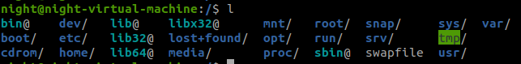
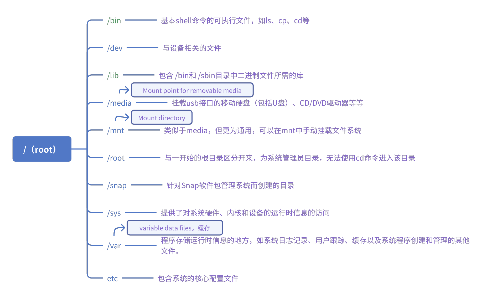

Linux中的所有文件和目录都位于根目录root下，root在地址索引中通常直接用'/'表示。

在我的Linux虚拟机下列出了根目录下的文件夹

对于其中的一些比较重要的目录做了一定的理解，简述如下：

其中/dev文件夹中不仅存放一些设备的驱动，还存放了访问外部设备的端口。我们可以非常方便地去访问这些外部设备，和访问一个文件，一个目录没有任何区别。（UNIX和LINUX系统的一个特点是把设备当成文件夹去访问）

对于/media，一般用于挂载可移动设备或媒体储存介质，提供了一个统一的位置，让用户可以方便地访问和管理这些外部设备。这个目录下的挂载是自动进行的，可移动设备插入计算机时，操作系统会自动检测到该设备，然后将其挂载到/media目录下的一个子目录中，通常以设备名称或标识命名。于是可以使用文件管理器访问和读写设备中的文件。而对于/mnt目录：一般情况下，用户需要手动指定挂载点并进行挂载操作，可以根据需要自定义挂载点的名称和位置。此外，/mnt更为通用，可用于各种文件系统的挂载。

对于/sys，它是一个虚拟文件系统，用于反映系统状态和提供系统管理的接口。可以在目录中找到有关硬件配置、状态和特性的详细信息。该目录下的一些文件允许读取和修改内核的参数和配置。通过修改这些文件，可以实现对系统的行为和性能的调整，例如调整调度器、内存管理和网络设置等。

/var，缓存，存放系统运行时的数据等。一些安装包就默认下载到/var/cache下。

对于Linux虚拟机文件结构的探索是从对ROS APT源upgrade失败开始的。之前有一次为了安装rosgraph，对apt源进行更新的过程中出现“在 /var/cache/apt/archives/ 上没有足够的可用空间”的问题。就是默认的安装包存放位置空间不足，这个问题可以使用将/var/cache/apt/archives/换成指向空间较为空闲的目录的软链接的方法来解决。

对于/etc，为系统的核心配置文件，如果需要对系统配置进行更改(例如，更改主机名)，可以在etc文件夹中找到相应的文件。

