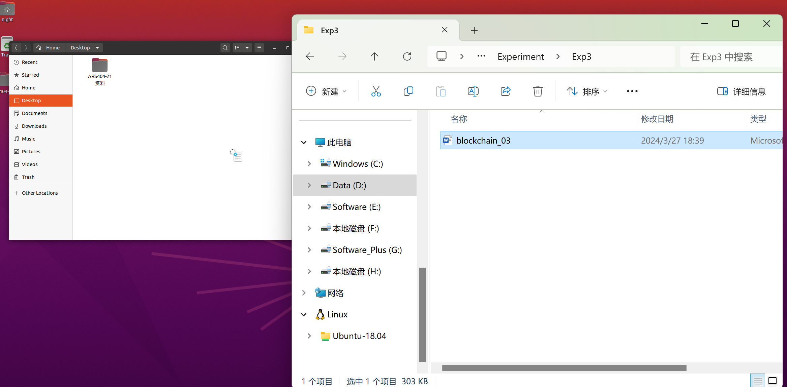
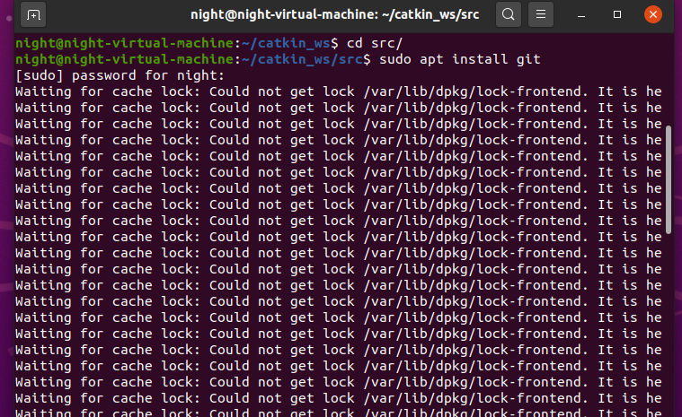

刚好下午的时候upgrade apt源不知道为什么导致虚拟机磁盘占满了，后来整个虚拟机无法启动，无奈将其删除了进行了系统重装和ROS开发环境的重配，虽然是按照b站的教程一步步来但是有些地方还是容易踩坑，所以打算记录一下重新配置的过程

## ubuntu安装

VMware的安装不必多说。

新建虚拟机的过程中有几个地方的配置如下

1. 首先来到安装向导的第一步，选择“稍后安装操作系统”。（如果直接勾选“安装程序光盘映像文件”，则进入简易安装，会少掉一些自主配置的选项）
2. 然后下一步，操作系统选择Linux, Ubuntu 64位
3. 填写虚拟机名称和保存位置
4. 分配内存等。这里我的配置是处理器内核数8；硬盘空间50G，选择将虚拟磁盘拆分为多个文件；内存8G。
5. 下一步，网络类型选择NAT（即共享主机ip地址），其余默认。
6. 新建完成后，找到CD/DVD栏，选择使用ISO镜像文件，导入下载的ubuntu系统镜像，然后开启虚拟机进行安装（ubuntu系统镜像地址https://old-releases.ubuntu.com/releases/20.04.1/）

ubuntu系统安装的一些配置如下

1. 选择语言为English（这会稍微简化之后一些地方的配置，比如ROS系统中一些输出函数设置中文编码）
2. 选择键盘布局为Chinese，以防出现键与实际键入值不对应的情况
3. 继续，选择最小安装（去掉用于冲浪打游戏的一些冗余应用），去掉勾选下载更新
4. 继续，选择清除整个磁盘然后安装Ubuntu
5. 之后的姓名等配置建议使用英文
6. 然后重启后完成安装

首先按照最简版本安装了ubuntu20.04

## 安装OpenVMTools

然后利用apt命令安装了openVMTools工具

??? class "关于APT源"

    参考https://blog.csdn.net/cxs5534/article/details/105712085<br /><br />

    APT是一个客户/服务器系统。在服务器上先复制所有DEB包，然后对所有的DEB包进行分析，并将该分析结果记录在一个文件中，这个文件称为DEB索引清单（即从网上各大应用商店生成APP索引），APT服务器的DEB索引清单置于base文件夹内。一旦APT 服务器内的DEB有所变动，一定要使用genbasedir产生新的DEB索引清单。客户端在进行安装或升级时先要查询DEB索引清单，从而可以获知所有具有依赖关系的软件包，并一同下载到客户端以便安装。<br /><br />

    当客户端需要安装、升级或删除某个软件包时，客户端计算机取得DEB索引清单压缩文件后，会将其解压置放于/var/state/apt/lists/，而客户端使用apt-get install或apt-get upgrade命令的时候，就会将这个文件夹内的数据和客户端计算机内的DEB数据库比对，知道哪些DEB已安装、未安装或是可以升级的。<br />

执行以下三行代码对openVMTools进行了安装（科学上网环境下，但是估计不需要科学上网也是可以的）

```shell
sudo apt-get autoremove open-vm-tools
sudo apt-get install open-vm-tools
sudo apt-get install open-vm-tools-desktop
```

注意这里安装完毕后重启才能生效。

重启之后的拖动效果：（这里拖进去的时候需要停留一会才能实现拖动）


## 配置中文环境

虚拟机安装好之后输入法并不能切换中文（尝试过一开始安装的时候选择中/英文，两种选择启动虚拟机后均只能运行英文输入法）

根据很多博客中的方法进行了尝试，在系统设置中完成语言的配置，但是发现还是得用命令行下载输入法才行，依据下面这篇csdn文章顺利完成了配置https://blog.csdn.net/Zhang950225/article/details/108435513

这里试了一下，按照以上文章配置，启动虚拟机后第一次切换中英文输入法需要使用control+space，之后再切换输入法只需要敲shift了。

## ROS相关配置

有关ROS的配置借鉴了B站的教程https://www.bilibili.com/video/BV1aP41137k9/?spm_id_from=333.1007.top_right_bar_window_history.content.click&vd_source=0ce5764b2d43320613b1dd7bc3ee3031

但是因为虚拟机配置有所不同，加上是两年前的教程所以有些地方变了，所以还是踩了一些坑。

以下记录按照以上教程进行配置后的一些心得。

首先安装ROS系统，这一步只需要在命令行中执行，所以如果在虚拟机中网速稍慢，可以在自己的电脑上打开ros.org网站，只需要复制其中相应的命令行代码。（另外这里注意一点，终端中的control+c有终止进程的效果，因此在终端中使用cv是无法复制粘贴的，终端中的复制粘贴只能右键然后选择copy/paste进行）


??? class "使用apt安装git"
    git安装
    
    解决方法：重启解决99%的问题x

    </r></r>

    这里一开始找到的文章如下https://blog.csdn.net/lun55423/article/details/108907779。
    后来还是觉得随便删文件风险太大，后来参考了评论区重启的方法成功。</r></r>

    后来发现git在一开始装ubuntu系统的时候就附带安装了

??? class "启动Gazebo闪退/黑屏"
    使用Gazebo打开机器人仿真项目时，出现Error报错，且Gazebo打开后黑屏无法显示模型的问题，有时候打开了模型仍然发生闪退。</r></r>

    尝试不从命令行加载模型，直接点击Gazebo图标打开，仍然发生闪退。</r></r>

    解决方法：将虚拟机关机后编辑虚拟机设置中关闭3D加速。于是一切正常，不会报错，模型也能正常显示。


